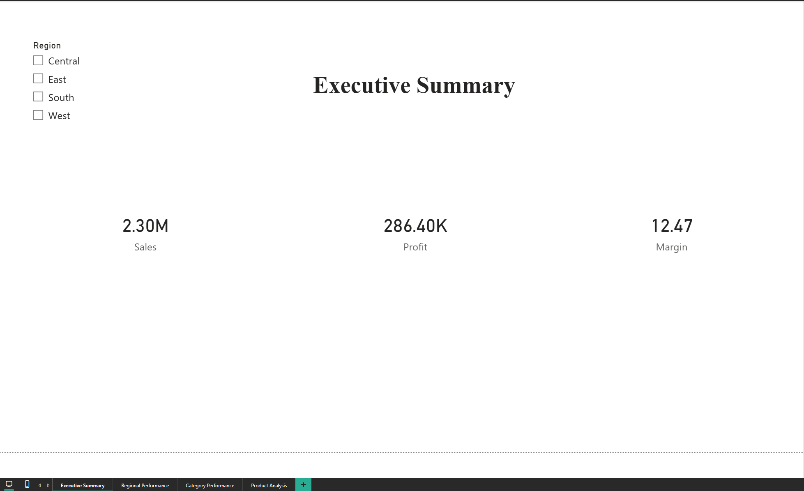
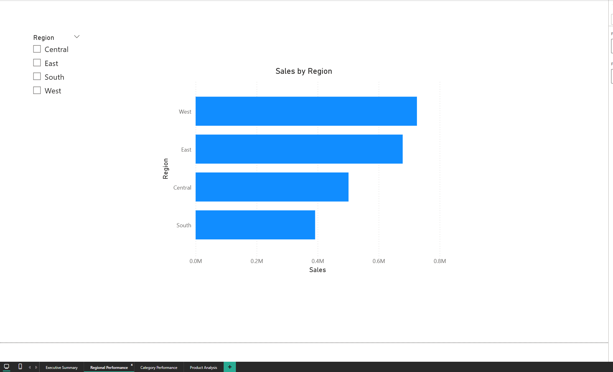
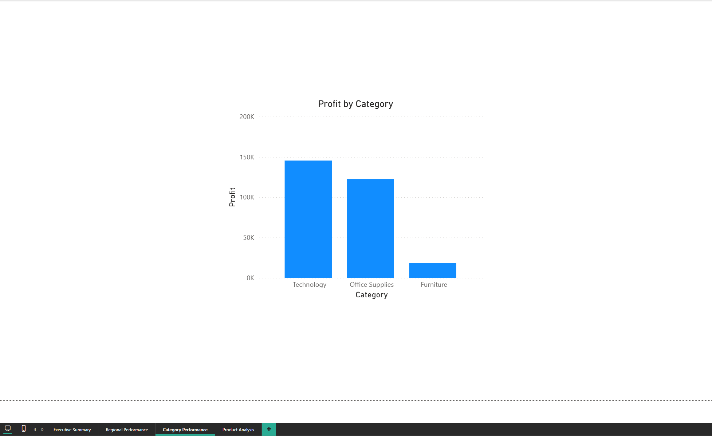
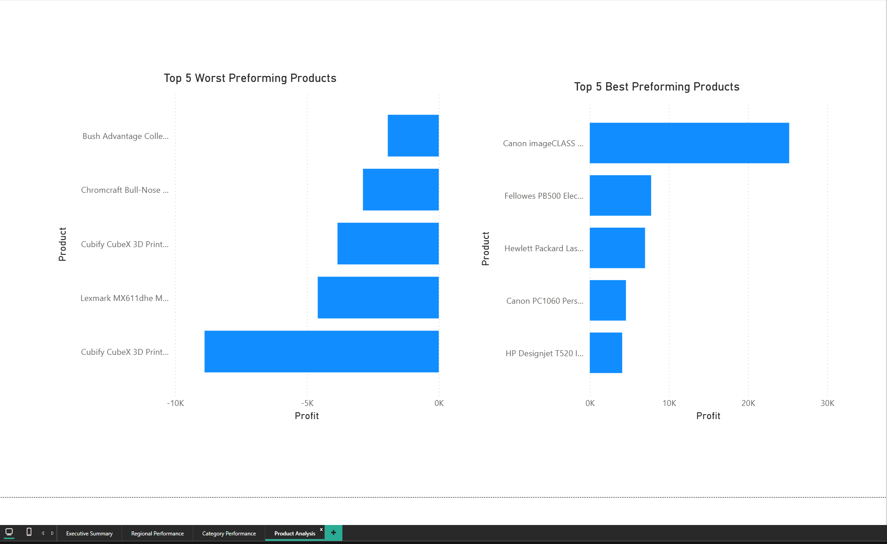

# Retail Sales Performance Analysis
### SQL + Power BI Dashboard Project

## Overview
Analyzed 9,994 retail transactions (2014–2017) using PostgreSQL to identify profit drivers, regional performance, product-level profitability, and discount impact.

## Tools
- PostgreSQL / SQL
- pgAdmin
- (Optional) Tableau / Power BI for dashboard

## Key Business Questions
1. What is overall sales, profit, and margin?
2. Which regions drive revenue and profitability?
3. Which categories drive profit and which underperform?
4. What are the top and bottom products by profit?
5. How do discounts affect margin?

## Key Findings
- Total sales: **$2.30M**, total profit: **$286.4K**, overall margin: **12.47%**
- **West** is the top region (highest sales and margin ~14.94%)
- **Central** has the weakest margin (~7.92%)
- **Technology** and **Office Supplies** have strong margins (~17%)
- **Furniture** has very low margin (~2.49%) despite high sales
- Worst-loss products include **Cubify 3D printers** and **conference tables**, contributing to margin erosion

## Business Insights

- The **West region** is the strongest market, contributing the highest sales and maintaining strong margins.
- The **Central region** shows weaker profitability, suggesting potential operational inefficiencies or excessive discounting.
- **Technology products** drive the majority of profits and represent the highest-margin category.
- **Furniture generates significant revenue but very low margins**, indicating pricing or cost structure issues.
- Certain products (e.g., **Cubify 3D printers**) consistently generate losses and may require pricing review or discontinuation

## Repository Structure

dataset/
- Raw Superstore dataset (CSV)
sql/
- SQL queries used for analysis
dashboard/
- Exported Power BI dashboard screenshots
README.md
- Project overview and insights

## How to Reproduce
1. Create a PostgreSQL database (e.g., `ecommerce_analysis`)
2. Create a table schema matching the CSV columns
3. Import the CSV into PostgreSQL
4. Run queries from `sql/analysis_queries.sql`

## Power BI Dashboard

### Executive Summary

### Regional Performance

### Category Performance

### Product Analysis

